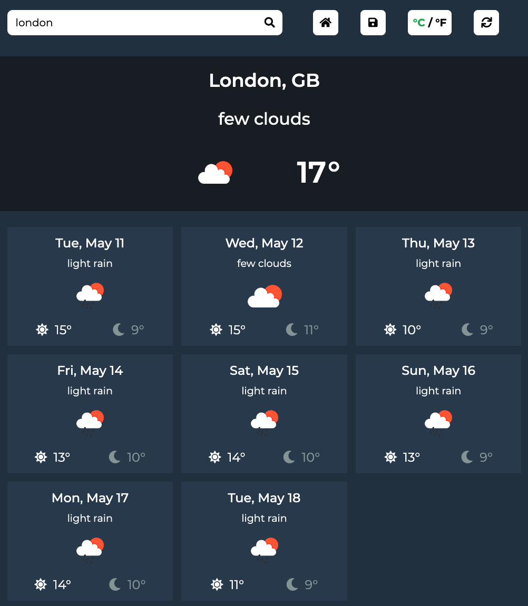

# Weather-app
Weather app created with HTML, CSS & Javascript for The Odin Project.

## Demo
Here is a working live demo: https://kapaha.github.io/weather-app/

## Installation
```bash
git clone git@github.com:kapaha/weather-app.git
npm install
```

## General info
This project was created as a part of the [Javascript](https://www.theodinproject.com/paths/full-stack-javascript/courses/javascript/lessons/weather-app) course with [The Odin Project](https://theodinproject.com). The aim of this project was to solidate the knowledge I have learnt about asynchronous javascript and APIs.

## Features
* Current weather data of cities and countries
* 7 day weather forecast
* Saving of a home location
* Saving of unit preference (°C / °F)
* Responsive design - works on mobile and tablets

## Built with
* HTML
* CSS
* Javascript
* Webpack
* [OpenWeather Api](https://openweathermap.org/api)

## Status
The project is finished, however I may continue to improve on it as my knowledge of web development improves.